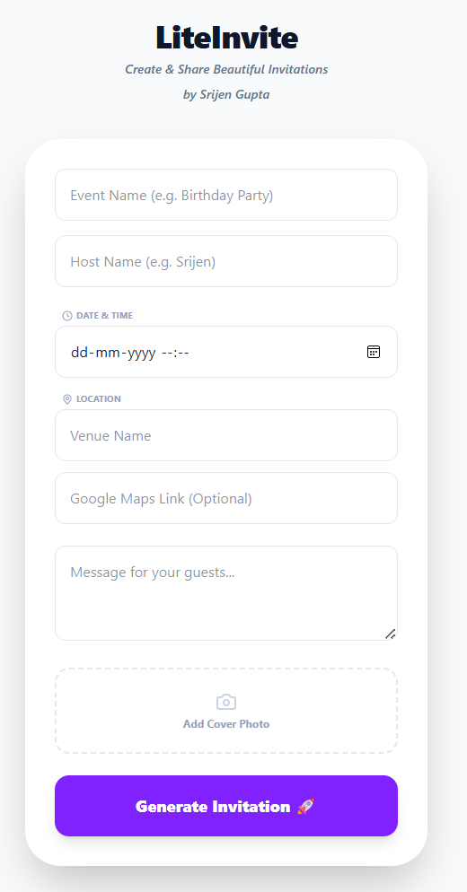
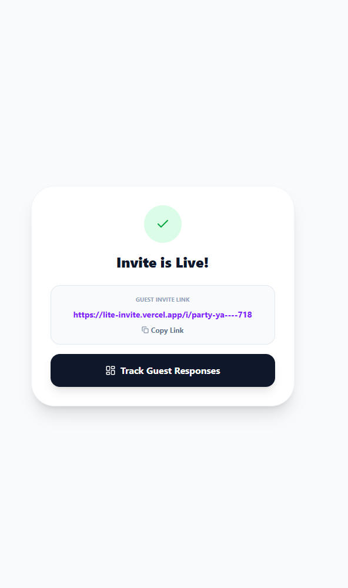
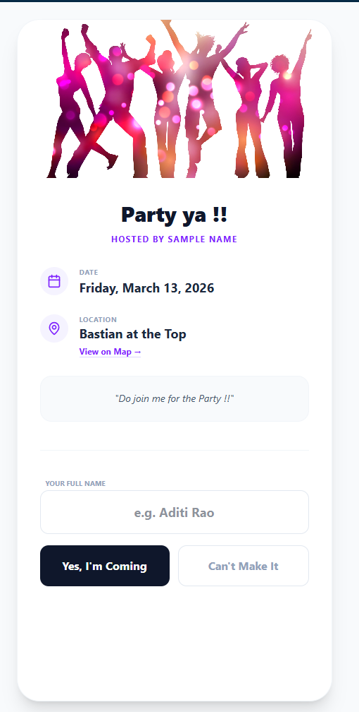
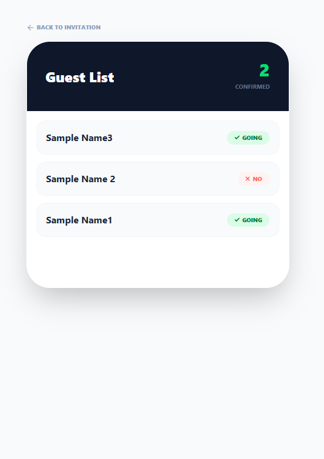

# 🚀 LiteInvite: Zero-Friction Event Management

**LiteInvite** is a high-speed, mobile-first invitation tool built to solve "Platform Fatigue." Unlike traditional event platforms that require mandatory sign-ups, LiteInvite allows hosts to create and share elegant digital invitations in seconds with zero onboarding friction for guests.

## 🎯 The Problem
Traditional digital invitation tools often suffer from high guest drop-off rates because they force users to download apps or create accounts. **LiteInvite** prioritizes **Time-to-Value**, focusing on a lean user journey that moves from "Idea" to "Shared Link" in under 60 seconds.

## 🚀 The Product Flow

### 1️⃣ Create
Hosts fill out a single-page form with event details and a cover photo. The UI is designed to be clean and intuitive.

### 2️⃣ Generate
The system instantly creates a unique, slug-based URL and a "magic link" for the host.

### 3️⃣ RSVP
Guests confirm attendance via a one-click interface. No login required, maximizing the response rate.

### 4️⃣ Track
Hosts monitor live responses via a private, real-time dashboard.

## ✨ Key Features
* **Zero-Login Architecture:** No signup required for hosts or guests, maximizing conversion.
* **Dynamic Social Previews:** Automated OpenGraph meta-tags ensure invites look professional when shared on WhatsApp.
* **Real-time Tracking:** Powered by PostgreSQL Realtime—see RSVPs as they happen without page refreshes.

## 🛠️ The Tech Stack (PM Perspective)
* **Frontend:** Next.js (React) & Tailwind CSS.
* **Backend:** Supabase (PostgreSQL) for real-time data sync.
* **Deployment:** Vercel for automated CI/CD.

## ⚖️ License
Distributed under the MIT License. See `LICENSE` for more information.

---
Created by Srijen Gupta
